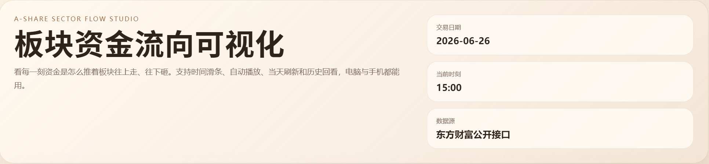
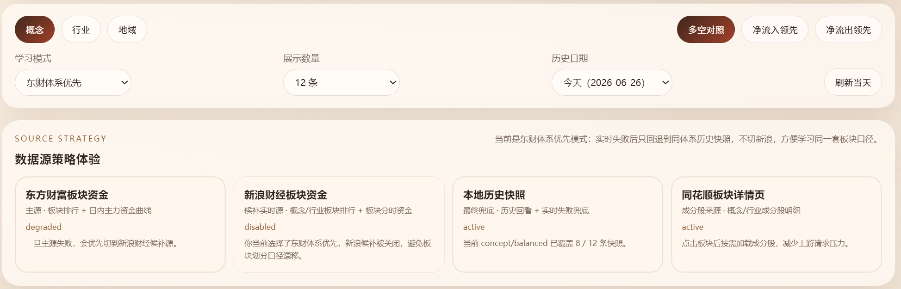
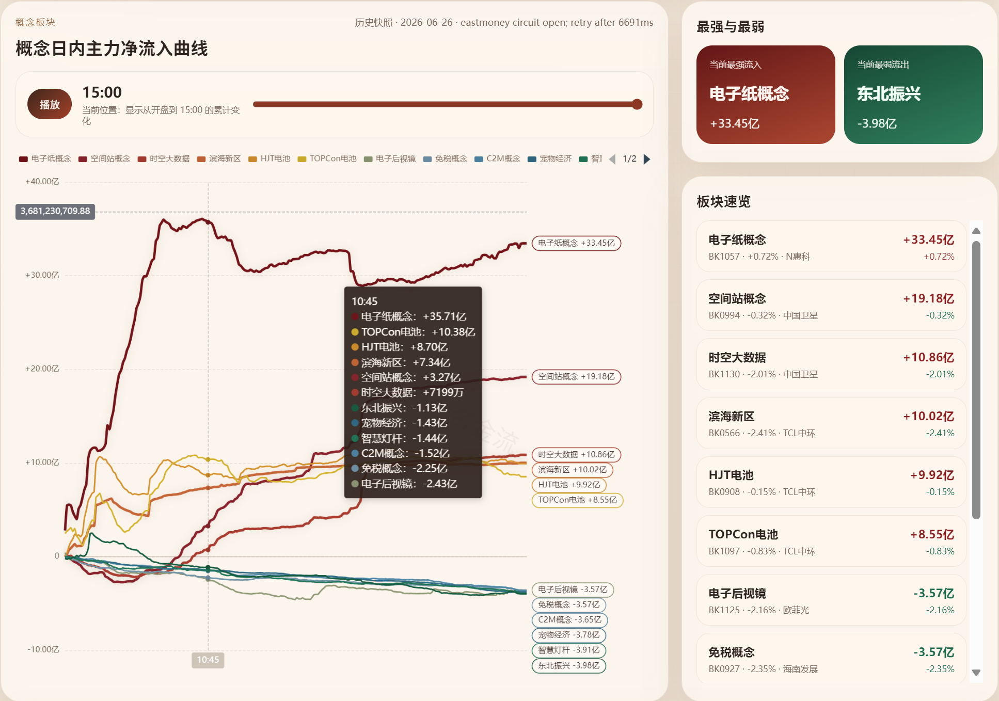

# A股板块资金流向可视化

一个用于观察 A 股板块资金流向的本地 Web 应用。它把板块资金排行、日内主力资金曲线、历史快照和成分股明细放在同一个界面里，适合用来复盘资金在不同板块之间的流动节奏。



## 这个项目做什么

普通行情页面通常只告诉你某个板块“涨了多少”或“流入多少”，但不容易看出资金是在什么时候开始加速、哪些板块互相分化、强弱关系有没有变化。这个项目把板块资金曲线画成一张可交互图表，并配合时间滑条、板块榜单和成分股明细，帮助你更直观地观察资金路径。

它更适合这些场景：

- 复盘当天资金主要流入和流出的板块
- 对比概念、行业、地域板块的强弱变化
- 观察某个板块资金是持续流入，还是盘中冲高后回落
- 点击板块后查看成分股，理解板块内部由哪些股票带动
- 在实时接口失败时，用本地历史快照继续查看页面效果



## 核心功能

- **板块视图**：支持概念、行业、地域三类板块。
- **排行模式**：支持多空对照、净流入领先、净流出领先。
- **日内曲线**：展示板块从开盘到当前时刻的主力净流入变化。
- **时间滑条**：可以把图表固定到某一时刻，观察当时的板块强弱。
- **自动播放**：沿着时间轴播放资金变化过程。
- **历史回看**：支持本地历史快照，方便复盘和演示。
- **演示数据模式**：内置一份轻量演示数据，首次运行也能直接看到完整效果。
- **数据源策略**：支持演示数据、口径稳定和实时优先三种模式。
- **本地图表依赖**：ECharts 通过 npm 安装并由本地服务提供，不再依赖外部 CDN。
- **成分股明细**：点击板块后按需加载成分股，减少不必要的请求。



## 本地运行

项目需要本机安装 Node.js。

```powershell
git clone https://github.com/dean-stack/a-share-sector-flow-visualizer.git
cd a-share-sector-flow-visualizer
npm install
npm start
```

如果你已经下载了项目源码，也可以直接在项目目录执行：

```powershell
npm start
```

启动后打开终端里显示的地址，默认是：

```text
http://localhost:3100
```

如果 `3100` 端口被占用，服务会自动尝试下一个可用端口，并在终端里打印最终地址。

也可以手动指定端口：

```powershell
$env:PORT="3200"
npm start
```

## 数据源怎么切换

页面里的“数据策略”就是主要的数据源开关：

- **演示数据模式**：默认模式。直接使用仓库内置的轻量演示数据，不请求外部接口，适合首次运行、离线演示和 README 展示。
- **口径稳定模式**：优先保持东方财富板块口径一致。实时失败后只回退到同体系历史快照，不主动切到新浪，适合学习同一套板块分类。
- **实时优先模式**：优先保证当天数据尽量可用。东方财富失败后，会尝试新浪财经候补源；如果仍失败，再回退到本地快照。

需要注意：不同平台的板块分类口径可能不完全一致，所以“实时优先模式”更适合看可用性，“口径稳定模式”更适合做同一口径复盘。

## 部署方式

### 方式一：普通 Node.js 运行

这是最简单的方式，适合自己电脑、云服务器或内网机器：

```powershell
npm start
```

如果要长期运行，可以用你熟悉的进程管理工具，例如 PM2、systemd、Windows 任务计划程序或服务器面板。

### 方式二：Docker 运行

仓库里已经包含 `Dockerfile`：

```powershell
docker build -t a-share-sector-flow-visualizer .
docker run --rm -p 3100:3100 a-share-sector-flow-visualizer
```

然后打开：

```text
http://localhost:3100
```

### 方式三：部署到公网服务器

可以把它部署到 VPS、云服务器或内网服务器上，再通过 Nginx/Caddy 做反向代理。因为这个项目需要后端去请求公开数据接口，所以不适合只当作纯静态网页直接丢到 GitHub Pages。

## 主要文件

- `server.mjs`：本地 Web 服务、API 路由、数据抓取、快照回退逻辑。
- `public/index.html`：页面结构。
- `public/app.js`：前端交互、图表渲染、时间轴和板块列表逻辑。
- `public/styles.css`：页面样式。
- `tdx_bridge.py`：可选的通达信桥接辅助脚本。
- `data/demo/`：内置演示数据，提交到 Git，保证首次运行可见效果。
- `data/snapshots/`：本地实时快照缓存，默认不提交到 Git。
- `docs/overview.png`：README 顶部概览效果图。
- `docs/source-strategy.png`：筛选面板和数据源策略效果图。
- `docs/flow-chart.png`：主力资金曲线和板块速览效果图。
- `.env.example`：可选环境变量示例。
- `Dockerfile`：容器化部署文件。

## 数据说明

项目使用公开网页接口获取板块资金数据。由于公开接口可能出现延迟、失败、字段变化或访问限制，应用内置了本地快照回退机制：当实时数据不可用时，页面会尽量使用已有历史快照继续展示。

当前数据源策略包括：

- 内置演示数据：默认模式，用于首次运行、离线展示和 README 效果复现。
- 东方财富板块资金：主要数据源。
- 新浪财经板块资金：部分场景下的实时候补源。
- 本地历史快照：实时接口失败时的最终兜底。
- 同花顺板块详情页：用于按需加载部分板块成分股信息。

项目还提供健康检查接口：

```text
http://localhost:3100/api/health
```

## 当前限制和后续改进

这个项目现在已经可以作为本地可视化工具使用，但如果希望给更多人稳定使用，还可以继续完善：

- **演示数据不代表实时行情**：默认模式使用仓库内置的压缩演示数据，只用于展示交互效果。要看当天行情，需要切换到“口径稳定模式”或“实时优先模式”。
- **公开接口稳定性不可控**：东方财富、新浪、同花顺的公开网页接口可能限流、变更字段或临时不可用。后续可以做更清晰的错误提示、重试策略和数据源健康检查。
- **数据源口径会漂移**：不同平台的板块分类不完全一致。现在用“口径稳定模式 / 实时优先模式”来控制取舍，后续可以把口径差异做成更明确的说明面板。
- **图表库已本地化，但仍需安装依赖**：ECharts 已经通过 npm 固定为本地依赖。普通 Node.js 运行前需要执行 `npm install`，Docker 会在构建时自动安装。
- **生产部署还比较轻量**：目前适合单机运行。后续可以补充缓存清理策略、日志分级、健康检查接口和更完整的部署模板。
- **通达信桥接是可选能力**：`tdx_bridge.py` 依赖本机通达信目录，别人没有通达信也能使用主页面，但相关本地行情能力不会生效。需要时可通过 `TDX_HOME` 和 `TDX_PYTHON` 环境变量配置。

## 适合谁用

这个项目适合想学习前端可视化、Node.js 数据接口、A 股板块资金结构，或者想做盘后复盘工具原型的人。它不是交易系统，也不会自动给出买卖建议。

## 免责声明

本项目仅用于学习、研究和数据可视化练习，不构成任何投资建议。公开数据源可能存在延迟、缺失或接口变化，请以官方平台信息为准。任何投资决策都应由你自行判断并承担风险。

---

# A-Share Sector Flow Visualizer

A local web app for visualizing A-share sector money flow. It combines sector rankings, intraday main-fund flow curves, historical snapshots, and on-demand constituent stock details in one interface, making it easier to review how capital rotates between sectors.


## What It Does

Most market pages show whether a sector is up or down, but they do not always make it easy to see when money started accelerating, whether inflow was sustained, or how different sectors diverged intraday. This project turns sector flow data into an interactive chart with a timeline slider, ranking panel, source status, and constituent stock details.

It is useful for:

- Reviewing the strongest inflow and outflow sectors of the day
- Comparing concept, industry, and region sector behavior
- Checking whether a sector had sustained inflow or only a brief spike
- Opening a sector to inspect its constituent stocks
- Demonstrating the UI with local snapshots when live data is unavailable


## Features

- **Sector views**: concept, industry, and region sectors.
- **Ranking modes**: balanced, net inflow, and net outflow.
- **Intraday curves**: main-fund net flow from market open to the selected time.
- **Timeline slider**: freeze the chart at a specific intraday moment.
- **Playback**: replay the flow timeline automatically.
- **Historical snapshots**: review previously captured local data.
- **Demo data mode**: bundled lightweight demo data makes the first run useful even when live endpoints fail.
- **Source strategy**: demo data, stable taxonomy mode, and realtime-first mode.
- **Local chart dependency**: ECharts is installed through npm and served locally instead of relying on an external CDN.
- **Constituent details**: load sector constituents on demand.


## Run Locally

Node.js is required.

```powershell
git clone https://github.com/dean-stack/a-share-sector-flow-visualizer.git
cd a-share-sector-flow-visualizer
npm install
npm start
```

If you already have the source code, run this in the project directory:

```powershell
npm start
```

Then open the URL printed by the server. The default is:

```text
http://localhost:3100
```

If port `3100` is occupied, the server will try the next available port and print the final URL in the terminal.

You can also choose a port explicitly:

```powershell
$env:PORT="3200"
npm start
```

## Switching Data Sources

The “data strategy” selector controls the main data-source strategy:

- **Demo data mode**: the default mode. It uses bundled lightweight demo data and does not request external market endpoints, making first-run and offline demos reliable.
- **Stable taxonomy mode**: keeps the Eastmoney sector taxonomy stable. If live requests fail, the app falls back only to compatible Eastmoney snapshots instead of switching to Sina.
- **Realtime-first mode**: prioritizes live availability. If Eastmoney fails, the app tries Sina as a live fallback, then falls back to local snapshots.

Different platforms can classify sectors differently, so realtime-first mode is better for availability, while stable taxonomy mode is better for same-taxonomy review.

## Deployment

### Option 1: Plain Node.js

This is the simplest option for a local machine, VPS, cloud server, or internal server:

```powershell
npm start
```

For long-running use, pair it with a process manager such as PM2, systemd, Windows Task Scheduler, or your server control panel.

### Option 2: Docker

The repository includes a `Dockerfile`:

```powershell
docker build -t a-share-sector-flow-visualizer .
docker run --rm -p 3100:3100 a-share-sector-flow-visualizer
```

Then open:

```text
http://localhost:3100
```

### Option 3: Public Server

You can deploy it to a VPS, cloud server, or internal server and put Nginx/Caddy in front of it. Because the app needs a backend server to request public data endpoints, it is not suitable as a GitHub Pages-only static site.

## Project Files

- `server.mjs`: local web server, API routes, data fetching, and snapshot fallback logic.
- `public/index.html`: page structure.
- `public/app.js`: frontend interaction, chart rendering, timeline, and sector list logic.
- `public/styles.css`: page styling.
- `tdx_bridge.py`: optional Tongdaxin bridge helper.
- `data/demo/`: bundled demo data committed to Git for a reliable first-run experience.
- `data/snapshots/`: local live snapshot cache, ignored by Git by default.
- `docs/overview.png`: overview screenshot used near the top of this README.
- `docs/source-strategy.png`: filters and source strategy screenshot.
- `docs/flow-chart.png`: main flow chart and sector ranking screenshot.
- `.env.example`: optional environment variable examples.
- `Dockerfile`: container deployment file.

## Data Notes

This project uses public web endpoints for sector flow data. Public endpoints may be delayed, unavailable, rate-limited, or changed by upstream providers. To keep the app usable for review and demonstration, it can fall back to local historical snapshots when live requests fail.

Current source strategy:

- Built-in demo data: default source for first-run, offline demos, and README screenshot reproduction.
- Eastmoney sector flow: primary source.
- Sina sector flow: optional live fallback in supported scenarios.
- Local snapshots: final fallback when live data is unavailable.
- Tonghuashun sector pages: on-demand source for some constituent details.

The project also provides a health-check endpoint:

```text
http://localhost:3100/api/health
```

## Current Limitations and Roadmap

The project is already usable as a local visualization tool, but it can still be improved for wider public use:

- **Demo data is not live market data**: the default mode uses bundled compressed demo data only to show the interaction model. Switch to stable taxonomy mode or realtime-first mode for live data.
- **Public endpoints are not fully reliable**: Eastmoney, Sina, and Tonghuashun public web endpoints may be rate-limited, delayed, unavailable, or changed by upstream providers. Better error messages, retry controls, and source health checks would help.
- **Sector taxonomy may drift across providers**: different platforms do not always classify sectors identically. The current strategy selector makes the tradeoff explicit, but future versions could explain taxonomy differences more clearly in the UI.
- **Dependencies still need installation**: ECharts is now pinned as a local npm dependency. Plain Node.js usage requires `npm install`; Docker installs dependencies during build.
- **Production deployment is still lightweight**: the app is currently designed for single-machine use. Cache cleanup, structured logs, health checks, and richer deployment templates would make it more production-ready.
- **Tongdaxin integration is optional**: `tdx_bridge.py` depends on a local Tongdaxin installation. The main page works without it, but local market helper features require `TDX_HOME` and `TDX_PYTHON` configuration.

## Who This Is For

This project is useful if you want to learn frontend visualization, Node.js API design, A-share sector flow structure, or build a prototype for after-market review. It is not an automated trading system and does not provide buy or sell signals.

## Disclaimer

This project is for learning, research, and data visualization practice only. It is not investment advice. Public data sources may be delayed, incomplete, or changed by upstream providers; use official platforms as the final reference. Any investment decision is your own responsibility.
